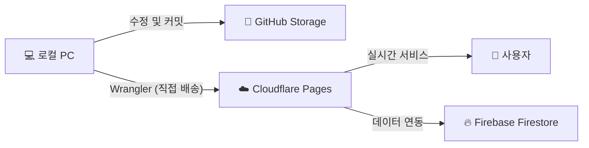

# 🏆 정보자원통합 보물찾기 (select)

이 프로젝트는 Firebase Firestore를 백엔드로 사용하는 정적 HTML 기반의 이벤트 애플리케이션입니다.

## 🚀 서비스 아키텍처 및 배포 구조

본 프로젝트는 **'로컬 작업 → GitHub 저장 → Cloudflare 배포'**의 3단계 항로를 통해 운영됩니다.

1.  **GitHub (저장소/창고)**: [freudpark/select](https://github.com/freudpark/select)
    - 소스 코드의 원본과 작업 역사가 영구 보관됩니다.
2.  **Wrangler (배달부)**:
    - 로컬 코드를 Cloudflare 서버로 전송하는 도구입니다. 커맨드라인에서 즉시 배포가 가능합니다.
3.  **Cloudflare Pages (매장/서버)**: [geo-m-cf.pages.dev](https://geo-m-cf.pages.dev)
    - 사용자가 실제로 접속하는 최종 웹사이트 공간입니다.

---

## 🛠️ 주요 수정 및 보완 사항

안정적인 서비스를 위해 다음 항목들을 최신화했습니다.

*   **이미지 경로 최적화**: `geo.jpg` 참조를 실제 파일인 `geo.png`로 일괄 수정하여 이미지 엑박 문제를 해결했습니다.
*   **Firebase 설정 동기화**: `index.html`과 `admin.html`의 Firebase 접속 정보를 일치시켜 관리자 기능이 정상 작동하도록 했습니다.
*   **관리자 보안 업데이트**: 기본 비밀번호를 요청된 전용 코드로 변경했습니다.

---

## 📋 운영 가이드 및 확인 사항

### 1. 관리실 (Admin) 접속
*   **주소**: `https://geo-m-cf.pages.dev/admin.html`
*   **비밀번호**: `qkrdydgml`
*   **주요 기능**: 당첨자 실시간 모니터링, 전화번호 목록 CSV 추출, 데이터 초기화

### 2. 주요 체크리스트
*   **이미지 확인**: 새로운 이미지를 올릴 때는 반드시 파일 확장자(`.png`, `.jpg`)가 코드와 일치하는지 확인하세요.
*   **Firebase 연동**: 데이터가 쌓이지 않는다면 `index.html`의 `firebaseConfig` 값이 유효한지 확인해야 합니다.
*   **배포 확인**: `npx wrangler pages deploy .` 명령어로 배포한 후 나타나는 `Deployment complete!` 메시지를 확인하세요.

---

## ⚠️ 오류 발생 가능성 및 해결

| 발생 가능한 문제 | 해결 방법 |
| :--- | :--- |
| **이미지 엑박 발생** | 파일 확장자가 `.png`인지 확인하고 대소문자 구분을 체크하세요. |
| **관리자 로그인 실패** | `ADMIN_PASSWORD` 변수가 최신화되었는지 소스 코드를 확인하세요. |
| **배포 권한 오류** | `npx wrangler login`을 통해 Cloudflare 계정이 로그인되었는지 확인하세요. |
| **Firestore 연결 실패** | Firebase 콘솔에서 보안 규칙(Security Rules)이 `allow read, write` 상태인지 점검하세요. |

---
**프로젝트 운영자: 파일럿 박 [CPO / 항해사]**